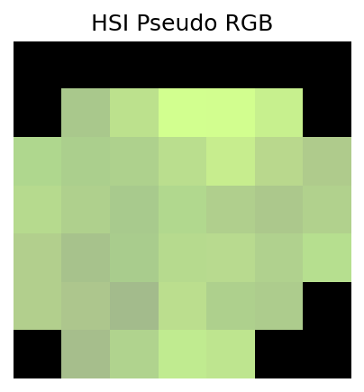

# NEON Multi-Modal Tree Species Dataset

Hyperspectral, RGB and LiDAR airborne data for **162 tree species** representing **42,453 individual trees** across **27 NEON sites** in North America.

## Dataset Overview

- **42,453** individual tree crowns
- **162** unique species  
- **27** NEON sites across North America
- **2014-2023** (10 years of data)
- **3 modalities:** RGB, Hyperspectral (426 bands), LiDAR CHM

## Quick Start

```python
# Load and explore the dataset
from neon_tree_classification.core.dataset import NeonCrownDataset

# Simple loading
dataset = NeonCrownDataset.load()
dataset.summary()  # Print dataset overview

# Filter for specific species or sites  
conifers = dataset.filter(species=['PSMEM', 'TSHE'])
west_coast = conifers.filter(sites=['ABBY', 'HARV'])

# Get dataset statistics
stats = dataset.get_dataset_stats()
```

## Visualization Examples

The package includes comprehensive visualization tools for all three modalities:

| RGB Image | HSI Pseudo RGB | HSI PCA Decomposition |
|-----------|----------------|----------------------|
|  |  |  |

| HSI Spectral Signatures | LiDAR Canopy Height Model |
|-------------------------|---------------------------|
|  |  |

```python
# Visualization functions for tree crown data
from neon_tree_classification.core.visualization import (
    plot_rgb, plot_hsi, plot_hsi_pca, plot_hsi_spectra, plot_lidar
)

# RGB visualization
plot_rgb('path/to/crown_rgb.tif')        # True color RGB image

# Hyperspectral visualization options  
plot_hsi('path/to/crown_hsi.tif')        # Pseudo RGB (bands ~660nm, ~550nm, ~450nm)
plot_hsi_pca('path/to/crown_hsi.tif')    # PCA decomposition to 3 components
plot_hsi_spectra('path/to/crown_hsi.tif') # Spectral signatures of pixels

# LiDAR visualization
plot_lidar('path/to/crown_chm.tif')      # Canopy height model with colorbar
```

### Quick Visualization with Dataset

```python
# Easy visualization with dataset integration
from neon_tree_classification.core.dataset import NeonCrownDataset

dataset = NeonCrownDataset.load()
sample = dataset.data.iloc[0]  # Get first sample

# Visualize all modalities for this tree crown
plot_rgb(sample['rgb_path'])
plot_hsi(sample['hsi_path'])  
plot_lidar(sample['lidar_path'])
```

## Top Species

The dataset includes 162 tree species. Here are the most common:

| Rank | Species | Count | Percentage |
|------|---------|-------|------------|
| 1 | Acer rubrum L. | 5,324 | 12.5% |
| 2 | Tsuga canadensis (L.) Carrière | 3,103 | 7.3% |
| 3 | Pseudotsuga menziesii (Mirb.) Franco var. menziesii | 2,678 | 6.3% |
| 4 | Pinus palustris Mill. | 1,974 | 4.6% |
| 5 | Quercus rubra L. | 1,843 | 4.3% |
| 6 | Pinus contorta Douglas ex Loudon var. latifolia Engelm. ex S. Watson | 1,822 | 4.3% |
| 7 | Tsuga heterophylla (Raf.) Sarg. | 1,394 | 3.3% |
| 8 | Populus tremuloides Michx. | 1,091 | 2.6% |
| 9 | Liriodendron tulipifera L. | 1,049 | 2.5% |
| 10 | Quercus alba L. | 1,004 | 2.4% |

## Geographic Distribution

Data collected from **27 NEON sites** across North America:

**1.** HARV: 6,672 samples (15.7%)  
**2.** MLBS: 5,056 samples (11.9%)  
**3.** GRSM: 4,774 samples (11.2%)  
**4.** DELA: 4,240 samples (10.0%)  
**5.** RMNP: 3,602 samples (8.5%)  
**6.** WREF: 3,517 samples (8.3%)  
**7.** OSBS: 2,101 samples (4.9%)  
**8.** BART: 1,827 samples (4.3%)  
**9.** UNDE: 1,678 samples (4.0%)  
**10.** CLBJ: 1,655 samples (3.9%)  

## Installation

### Basic Installation
```bash
# Clone the repository
git clone https://github.com/Ritesh313/NeonTreeClassification.git
cd NeonTreeClassification

# Install core dependencies
pip install .
```

### Optional Dependencies
```bash
# For development (tests, formatting, notebooks)
pip install .[dev]

# For data processing (geospatial tools)
pip install .[processing]

# For experiment logging
pip install .[logging]

# Install all optional dependencies
pip install .[dev,processing,logging]
```

## Repository Structure

```
NeonTreeClassification/
├── neon_tree_classification/          # Main package
│   ├── core/                         # Core functionality (dataset, visualization)
│   │   ├── dataset.py               # Enhanced dataset with filtering & stats
│   │   ├── datamodule.py            # PyTorch Lightning data module  
│   │   └── visualization.py         # All visualization functions
│   └── models/                      # ML architectures & Lightning modules
├── examples/                         # Training and comparison examples
│   ├── train.py                     # Main training script
│   └── compare_modalities.py        # Multi-modal comparison
├── notebooks/                        # Interactive exploration
│   └── visualization.ipynb          # Visualization demo notebook
├── processing/                       # Advanced data processing tools
├── scripts/                          # Automation utilities
├── sample_plots/                     # Generated sample images
└── training_data_clean.csv          # Main dataset file
```

## Interactive Notebook

Explore the dataset and visualization functions interactively:

```bash
# Start Jupyter and open the visualization notebook
jupyter notebook notebooks/visualization.ipynb
```

The notebook includes examples of:
- Loading and filtering the dataset
- RGB, HSI, and LiDAR visualizations  
- Interactive exploration of tree crown data

## Advanced Usage

### Multi-modal Training

```python
# Train models on different modalities
from neon_tree_classification.core.datamodule import NeonCrownDataModule
from neon_tree_classification.models.lightning_modules import RGBClassifier

# Setup data
datamodule = NeonCrownDataModule(
    csv_path="training_data_clean.csv",
    modalities=["rgb", "hsi", "lidar"],
    batch_size=32
)

# Train RGB model
classifier = RGBClassifier(num_classes=162)

import lightning as L
trainer = L.Trainer(max_epochs=50)
trainer.fit(classifier, datamodule)
```

### Data Processing

The package includes tools for processing NEON data, but most users will work with the pre-processed dataset.

```python
# For advanced users: process raw NEON data
from processing.shapefile_processor import ShapefileProcessor
processor = ShapefileProcessor()
sites_df, summary = processor.process_shapefiles(destination_dir)
```

## Dataset Details

### NEON Data Products
- **RGB**: `DP3.30010.001` - High-resolution orthorectified imagery
- **Hyperspectral**: `DP3.30006.002` - 426-band spectrometer reflectance  
- **LiDAR**: `DP3.30015.001` - Canopy Height Model

### Data Structure
```
training_data_clean.csv - Main dataset file
├── crown_id          - Unique identifier for each tree crown
├── site              - NEON site code
├── year              - Data collection year  
├── species           - Species code
├── species_name      - Full species name
├── height            - Tree height (meters)
├── rgb_path          - Path to RGB image
├── hsi_path          - Path to hyperspectral image
├── lidar_path        - Path to LiDAR CHM
└── [other metadata]  - Additional tree measurements
```

## Contributing

1. Fork the repository
2. Create a feature branch
3. Submit a pull request

## Authors

Ritesh Chowdhry

## Acknowledgments

- National Ecological Observatory Network (NEON)
- This dataset details were generated on 2025-08-26

