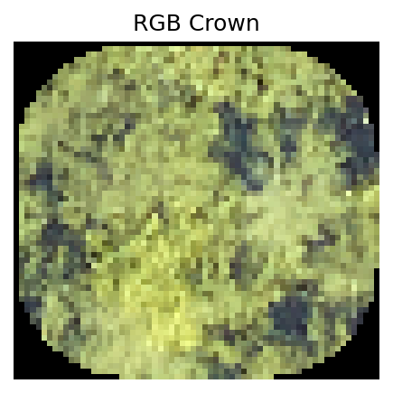
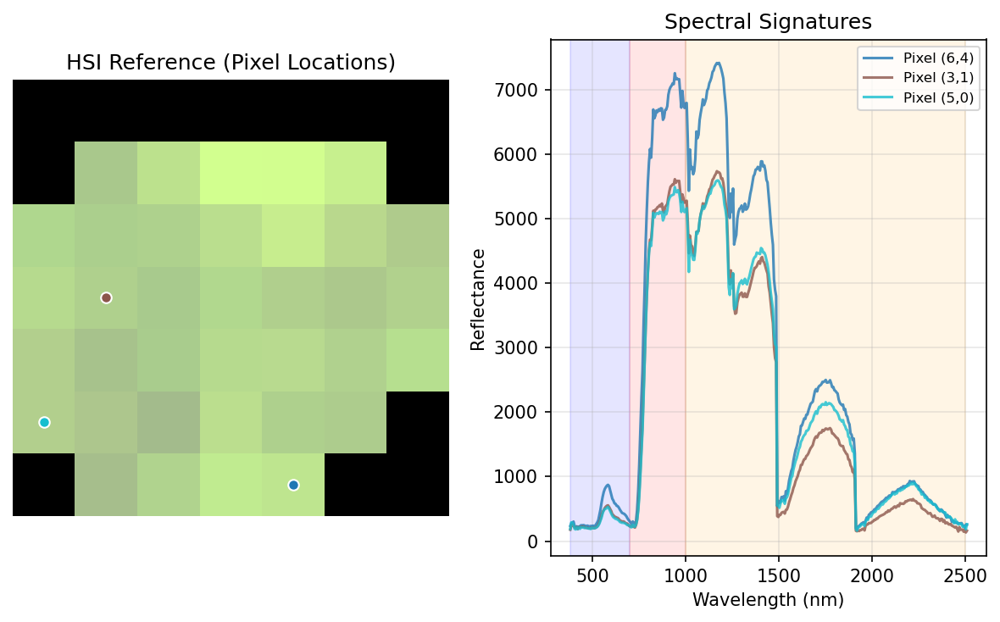
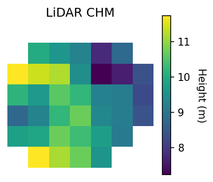

# NEON Multi-Modal Tree Species Classification Dataset

A comprehensive dataset of **167 tree species** with **47,971 individual tree crowns** from **30 NEON sites** across North America. Each sample includes RGB imagery, 369-band hyperspectral data, and LiDAR canopy height models.

## 🚀 Quick Start

### 1. Installation
```bash
# Clone the repository
git clone https://github.com/Ritesh313/NeonTreeClassification.git
cd NeonTreeClassification

# Install with uv (recommended - faster dependency resolution)
uv sync

# Or install with pip
pip install -e .
```

### 2. Quick Start with Ready-to-Run Example

**🚀 Try the quickstart script first:**
```bash
# Option A: Using uv run (recommended)
uv run python quickstart.py

# Option B: After activating environment
source .venv/bin/activate
python quickstart.py
```

This script demonstrates dataloader usage and **automatically downloads the dataset (590 MB)** on first use.

### 3. Using Dataloaders in Your Own Projects

Copy the code from `quickstart.py` or use it directly in your projects:

#### Option A: Using `uv run` (Recommended)
```bash
# Run your Python script (create in repo root directory)
uv run python your_analysis_script.py

# Or start Jupyter notebook
uv run jupyter notebook
```

#### Option B: Activate the environment (familiar to conda users)
```bash
# Activate the environment (Linux/Mac)
source .venv/bin/activate

# Now use regular Python commands (create scripts in repo root)
python your_analysis_script.py
jupyter notebook

# Deactivate when done
deactivate
```

#### Example: Getting the Dataloaders
```python
from scripts.get_dataloaders import get_dataloaders

# 📥 Dataset downloads automatically on first use (590 MB)
train_loader, test_loader = get_dataloaders(
    config='large',  # Choose: 'combined', 'large', or 'high_quality'
    modalities=['rgb', 'hsi', 'lidar'],  # Choose modalities
    batch_size=32
)

# Each batch contains:
for batch in train_loader:
    rgb_data = batch['rgb']        # torch.Tensor [batch_size, 3, 128, 128]
    hsi_data = batch['hsi']        # torch.Tensor [batch_size, 369, 12, 12]
    lidar_data = batch['lidar']    # torch.Tensor [batch_size, 1, 12, 12]
    labels = batch['species_idx']  # torch.Tensor [batch_size] (class indices)
    # Optional metadata (if include_metadata=True):
    # batch['crown_id'], batch['species'], batch['site']
```

### 4. Running the Complete Training Pipeline (Optional)
```bash
# Use our complete training script
uv run python examples/train.py
```

> **💡 Optional**: For manual control, you can pre-download the dataset using `python scripts/download_dataset.py`

## 📊 Dataset Configurations

The dataset comes with **3 pre-configured subsets** for different use cases:

| Configuration | Samples | Species | Description |
|---------------|---------|---------|-------------|
| **`combined`** | 47,971 | 167 | Complete dataset with all available samples |
| **`large`** | ~42,000 | ~162 | Main training set |
| **`high_quality`** | ~5,500 | ~96 | Curated subset with highest data quality |

### Key Dataset Features
- **🎯 Flexible Filtering:** Filter by species, sites, years, or modalities
- **🌍 Geographic Coverage:** 30 NEON sites across diverse North American ecosystems
- **📅 Temporal Range:** 10 years of data (2014-2023) for temporal analysis
- **🔬 Multi-modal:** RGB, 369-band hyperspectral, and LiDAR for each sample
- **📊 Rich Metadata:** Tree height, diameter, canopy position, and plot information

### 4 Training Scenarios
```python
# Scenario 1: Standard training on filtered dataset
train_loader, test_loader = get_dataloaders(config='large', test_ratio=0.2)

# Scenario 2: Maximum data training
train_loader, test_loader = get_dataloaders(config='combined', test_ratio=0.15)

# Scenario 3: High-quality only (smaller but cleaner)
train_loader, test_loader = get_dataloaders(config='high_quality', test_ratio=0.2)

# Scenario 4: Domain transfer (train on large, test on high-quality)
train_loader, test_loader = get_dataloaders(
    train_config='large',
    test_config='high_quality'
)
```

## 🌐 Dataset Overview

- **47,971** individual tree crowns
- **167** unique species
- **30** NEON sites across North America
- **2014-2023** (10 years of data)
- **3 modalities:** RGB (3 bands), Hyperspectral (369 bands), LiDAR CHM (1 band)
- **Ecological metadata:** Height (95.4% available), stem diameter (99.4% available), canopy position (81.4% available)
- **HDF5 storage:** Efficient compressed format for fast loading

## Visualization Examples

The package includes comprehensive visualization tools for all three modalities:

| RGB Image | HSI Pseudo RGB | HSI PCA Decomposition |
|-----------|----------------|----------------------|
|  |  |  |

| HSI Spectral Signatures | LiDAR Canopy Height Model |
|-------------------------|---------------------------|
|  |  |

```python
# Visualization functions for tree crown data
from neon_tree_classification.core.visualization import (
    plot_rgb, plot_hsi, plot_hsi_pca, plot_hsi_spectra, plot_lidar
)
from neon_tree_classification.core.dataset import NeonCrownDataset

# Load dataset and get a sample
dataset = NeonCrownDataset.load()
sample_data = dataset[0]  # Get first sample (returns dict with rgb, hsi, lidar arrays)

# Visualize each modality using the numpy arrays directly
plot_rgb(sample_data['rgb'])             # True color RGB image from array
plot_hsi(sample_data['hsi'])             # Pseudo RGB (bands ~660nm, ~550nm, ~450nm)
plot_hsi_pca(sample_data['hsi'])         # PCA decomposition to 3 components
plot_hsi_spectra(sample_data['hsi'])     # Spectral signatures of pixels
plot_lidar(sample_data['lidar'])         # Canopy height model with colorbar
```

### Interactive Visualization Notebook

For comprehensive data exploration and visualization examples, see:
```bash
# Open the visualization notebook
jupyter notebook notebooks/visualization.ipynb
```

## Top Species

The dataset includes 167 tree species. Here are the most common:

| Rank | Species | Count | Percentage |
|------|---------|-------|------------|
| 1 | Acer rubrum L. | 5,684 | 11.8% |
| 2 | Tsuga canadensis (L.) Carrière | 3,303 | 6.9% |
| 3 | Pseudotsuga menziesii (Mirb.) Franco var. menziesii | 2,978 | 6.2% |
| 4 | Pinus palustris Mill. | 2,207 | 4.6% |
| 5 | Quercus rubra L. | 2,086 | 4.3% |
| 6 | Pinus contorta Douglas ex Loudon var. latifolia Engelm. ex S. Watson | 2,011 | 4.2% |
| 7 | Tsuga heterophylla (Raf.) Sarg. | 1,425 | 3.0% |
| 8 | Populus tremuloides Michx. | 1,362 | 2.8% |
| 9 | Liriodendron tulipifera L. | 1,152 | 2.4% |
| 10 | Quercus alba L. | 1,139 | 2.4% |

## Geographic Distribution

Data collected from **30 NEON sites** across North America:

**1.** HARV: 7,162 samples (14.9%)
**2.** MLBS: 5,424 samples (11.3%)
**3.** GRSM: 4,822 samples (10.1%)
**4.** DELA: 4,539 samples (9.5%)
**5.** RMNP: 3,931 samples (8.2%)
**6.** WREF: 3,616 samples (7.5%)
**7.** BART: 2,360 samples (4.9%)
**8.** OSBS: 2,192 samples (4.6%)
**9.** UNDE: 1,940 samples (4.0%)
**10.** CLBJ: 1,754 samples (3.7%)

## Installation

### Prerequisites
- Python 3.9+ (recommended: Python 3.11)
- CUDA-capable GPU (optional, but recommended for training)

### Recommended: Using uv (Fast Python Package Manager)
```bash
# Clone the repository
git clone https://github.com/Ritesh313/NeonTreeClassification.git
cd NeonTreeClassification

# Install uv if not already installed
curl -LsSf https://astral.sh/uv/install.sh | sh
# or: pip install uv

# Install with uv (automatically handles dependencies)
uv sync

# Install with specific dependency groups
uv sync --extra dev          # Add development tools (testing, formatting)
uv sync --extra processing   # Add geospatial processing tools (for advanced users)
uv sync --extra logging      # Add experiment logging tools (Comet ML, WandB)
uv sync --all-extras         # Install everything
```

### Alternative: Using pip
```bash
# Install core dependencies
pip install -e .

# Install optional dependencies
pip install -e .[dev,processing,logging]
```

## Baseline Classification Results

Preliminary single-modality baseline results for **167-species classification** using the `combined` dataset configuration (seed=42, no hyperparameter optimization):

| Modality | Test Accuracy | Model | Notes |
|----------|---------------|-------|-------|
| **RGB** | 53.5% | ResNet | Standard computer vision approach |
| **HSI** | 27.3% | Spectral CNN | 369-band hyperspectral data |
| **LiDAR** | 11.5% | Structural CNN | Canopy height model |

*167-species classification is inherently challenging. These are basic preliminary results with default parameters - significant improvements possible with hyperparameter tuning, data augmentation, and architectural improvements.*

### Reproduce Results

**Prerequisites:** First run dataloaders to download dataset:
```python
from scripts.get_dataloaders import get_dataloaders
# This downloads the dataset to _neon_tree_classification_dataset_files/
train_loader, test_loader = get_dataloaders(config='combined')
```

**With Comet ML (exact reproduction):**
```bash
# RGB baseline (requires Comet ML setup)
uv run python examples/train.py \
    --csv_path _neon_tree_classification_dataset_files/metadata/combined_dataset.csv \
    --hdf5_path _neon_tree_classification_dataset_files/neon_dataset.h5 \
    --modality rgb --model_type resnet --batch_size 1024 --seed 42 \
    --logger comet --early_stop_patience 15

# HSI baseline (requires Comet ML setup)  
uv run python examples/train.py \
    --csv_path _neon_tree_classification_dataset_files/metadata/combined_dataset.csv \
    --hdf5_path _neon_tree_classification_dataset_files/neon_dataset.h5 \
    --modality hsi --model_type spectral_cnn --batch_size 128 --seed 42 \
    --logger comet --early_stop_patience 15

# LiDAR baseline (requires Comet ML setup)
uv run python examples/train.py \
    --csv_path _neon_tree_classification_dataset_files/metadata/combined_dataset.csv \
    --hdf5_path _neon_tree_classification_dataset_files/neon_dataset.h5 \
    --modality lidar --model_type structural --batch_size 1024 --seed 42 \
    --logger comet --early_stop_patience 15
```

**Without Comet ML (approximate reproduction):**
```bash
# RGB baseline (fixed epochs)
uv run python examples/train.py \
    --csv_path _neon_tree_classification_dataset_files/metadata/combined_dataset.csv \
    --hdf5_path _neon_tree_classification_dataset_files/neon_dataset.h5 \
    --modality rgb --model_type resnet --batch_size 1024 --seed 42 --epochs 100

# HSI baseline (fixed epochs)
uv run python examples/train.py \
    --csv_path _neon_tree_classification_dataset_files/metadata/combined_dataset.csv \
    --hdf5_path _neon_tree_classification_dataset_files/neon_dataset.h5 \
    --modality hsi --model_type spectral_cnn --batch_size 128 --seed 42 --epochs 100

# LiDAR baseline (fixed epochs)
uv run python examples/train.py \
    --csv_path _neon_tree_classification_dataset_files/metadata/combined_dataset.csv \
    --hdf5_path _neon_tree_classification_dataset_files/neon_dataset.h5 \
    --modality lidar --model_type structural --batch_size 1024 --seed 42 --epochs 100
```
*Note: Without early stopping, results may vary. Original experiments used Comet ML logging with early stopping (patience=15).*

## Repository Structure

```
NeonTreeClassification/
├── 📁 neon_tree_classification/      # Main Python package
│   ├── core/                        # Core functionality
│   │   ├── dataset.py              # HDF5-based dataset class
│   │   ├── datamodule.py           # PyTorch Lightning data module
│   │   └── visualization.py        # Multi-modal visualization tools
│   └── models/                      # ML architectures & training modules
├── 📁 scripts/                       # Easy-to-use scripts
│   ├── download_dataset.py         # Download & extract dataset
│   ├── get_dataloaders.py          # Simple DataLoader factory
├── 📁 examples/                      # Training examples
│   └── train.py                    # Flexible training script
├── 📁 notebooks/                     # Interactive exploration
│   └── visualization.ipynb         # Dataset exploration & visualization
├── 📁 processing/                    # NEON raw data processing tools
│   └── neon_data_processing/       # Scripts for processing raw NEON data products
├── 📁 sample_plots/                  # Generated example visualizations
├── pyproject.toml                   # Package configuration & dependencies
└── uv.lock                         # Dependency lock file
```

*Note: Dataset automatically downloads to `_neon_tree_classification_dataset_files/` on first use.*

## Training Models

Use the flexible training script with different modalities:

```bash
# Train RGB classifier
python examples/train.py --modality rgb --csv_path _neon_tree_classification_dataset_files/metadata/large_dataset.csv --hdf5_path _neon_tree_classification_dataset_files/neon_dataset.h5

# Train hyperspectral classifier
python examples/train.py --modality hsi --csv_path _neon_tree_classification_dataset_files/metadata/combined_dataset.csv --hdf5_path _neon_tree_classification_dataset_files/neon_dataset.h5 --batch_size 16

# Train LiDAR classifier
python examples/train.py --modality lidar --csv_path _neon_tree_classification_dataset_files/metadata/high_quality_dataset.csv --hdf5_path _neon_tree_classification_dataset_files/neon_dataset.h5

# Advanced: External test set (train on large, test on high_quality)
python examples/train.py --modality rgb --csv_path _neon_tree_classification_dataset_files/metadata/large_dataset.csv --hdf5_path _neon_tree_classification_dataset_files/neon_dataset.h5 --external_test_csv _neon_tree_classification_dataset_files/metadata/high_quality_dataset.csv
```

### Add Custom Models
Create new model architectures in `neon_tree_classification/models/` and reference them with the `--model_type` flag.

## Advanced Usage

### Custom Data Filtering & Lightning DataModule

```python
# For advanced users: Use Lightning DataModule with flexible splitting
from neon_tree_classification.core.datamodule import NeonCrownDataModule

# Basic configuration with species/site filtering
datamodule = NeonCrownDataModule(
    csv_path="_neon_tree_classification_dataset_files/metadata/combined_dataset.csv",
    hdf5_path="_neon_tree_classification_dataset_files/neon_dataset.h5",
    modalities=["rgb"],  # Single modality training
    batch_size=32,
    # Filtering options
    species_filter=["PSMEM", "TSHE"],  # Train on specific species
    site_filter=["HARV", "OSBS"],      # Train on specific sites
    year_filter=[2018, 2019],          # Train on specific years
    # Split method options
    split_method="site",  # Options: "random", "site", "year"
    val_ratio=0.15,
    test_ratio=0.15
)

# For external test sets (advanced)
datamodule = NeonCrownDataModule(
    csv_path="_neon_tree_classification_dataset_files/metadata/combined_dataset.csv",
    hdf5_path="_neon_tree_classification_dataset_files/neon_dataset.h5",
    external_test_csv_path="path/to/external_test.csv",  # Optional external test
    external_test_hdf5_path="path/to/external_test.h5",  # Optional external HDF5
    modalities=["rgb"]
)

datamodule.setup("fit")  # Auto-filters species for compatibility
```

### Data Processing Pipeline

The `processing/` folder contains a comprehensive NEON data processing pipeline:

**Core Processing Steps:**
1. **Download NEON tiles** (`neon_downloader.py`) - Downloads RGB, HSI, LiDAR data from NEON API
2. **Curate tiles** (`curate_tiles.py`) - Quality control and tile selection
3. **Process shapefiles** (`shapefile_processing/`) - Extract crown metadata and validate annotations
4. **Crop crowns** (`crop_crowns_multimodal.py`) - Extract individual tree crowns from tiles
5. **Convert formats** (`convert_tif_to_npy.py`, `hsi_convert_h5_to_tif.py`) - Optimize data storage
6. **Generate datasets** (`create_training_csv.py`) - Create final training/test CSVs
7. **Filter & combine** (`misc/filter_rare_species.py`, `dataset_combiner.py`) - Dataset refinement

## Dataset Details

### NEON Data Products
- **RGB**: `DP3.30010.001` - High-resolution orthorectified imagery
- **Hyperspectral**: `DP3.30006.002` - 426-band spectrometer reflectance
- **LiDAR**: `DP3.30015.001` - Canopy Height Model

### Data Structure
```
_neon_tree_classification_dataset_files/metadata/combined_dataset.csv - Main dataset file
├── crown_id          - Unique identifier for each tree crown
├── individual        - NEON individual tree ID
├── individual_id     - Full individual identifier
├── site              - NEON site code
├── year              - Data collection year
├── species           - Species code
├── species_name      - Full species name
├── label_site        - Site where tree was labeled
├── height            - Tree height in meters (95.4% available)
├── stemDiameter      - Stem diameter in cm (99.4% available)
├── canopyPosition    - Light exposure: Full sun, Partially shaded, etc. (81.4% available)
├── plantStatus       - Tree health status: Live, Dead, etc. (99.99% available)
├── plot              - Plot identifier (currently "unknown" for all samples)
├── hand_annotated    - Whether crown was manually annotated (boolean)
├── rgb_path          - Path to RGB image in HDF5 dataset
├── hsi_path          - Path to hyperspectral image in HDF5 dataset
└── lidar_path        - Path to LiDAR CHM in HDF5 dataset
```

**Ecological Metadata**: Most samples include tree measurements that provide valuable ecological context for classification, though availability varies by field.

## Contributing

1. Fork the repository
2. Create a feature branch
3. Submit a pull request

## Acknowledgments

- National Ecological Observatory Network (NEON)
- Dataset statistics generated on 2025-08-28
