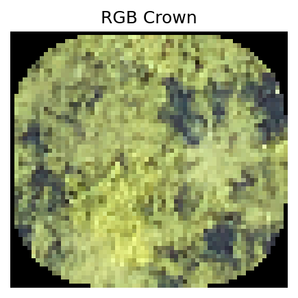
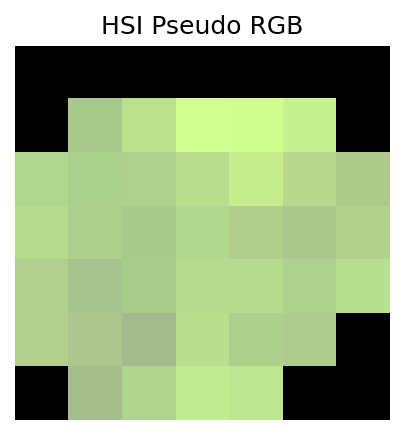
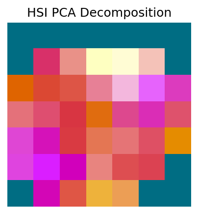
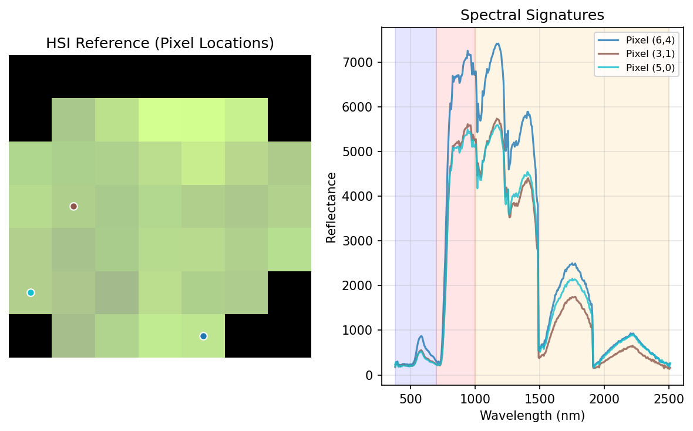
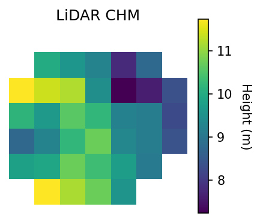

# Visualization Guide

This guide covers data visualization tools for exploring the NEON tree classification dataset.

## Overview

The package includes comprehensive visualization tools for all three modalities:
- RGB imagery
- Hyperspectral (HSI) data
- LiDAR canopy height models

## Example Visualizations

| RGB Image | HSI Pseudo RGB | HSI PCA Decomposition |
|-----------|----------------|----------------------|
|  |  |  |

| HSI Spectral Signatures | LiDAR Canopy Height Model |
|-------------------------|---------------------------|
|  |  |

## Visualization Functions

### Basic Usage

```python
from neon_tree_classification.core.visualization import (
    plot_rgb, plot_hsi, plot_hsi_pca, plot_hsi_spectra, plot_lidar
)
from neon_tree_classification.core.dataset import NeonCrownDataset

# Load dataset and get a sample
dataset = NeonCrownDataset.load()
sample_data = dataset[0]  # Returns dict with rgb, hsi, lidar arrays

# Visualize each modality
plot_rgb(sample_data['rgb'])             # True color RGB image
plot_hsi(sample_data['hsi'])             # Pseudo RGB from HSI bands
plot_hsi_pca(sample_data['hsi'])         # PCA decomposition to 3 components
plot_hsi_spectra(sample_data['hsi'])     # Spectral signatures
plot_lidar(sample_data['lidar'])         # Canopy height model with colorbar
```

## RGB Visualization

Display true-color RGB images:

```python
import matplotlib.pyplot as plt
from neon_tree_classification.core.visualization import plot_rgb

# Single sample
plot_rgb(sample_data['rgb'])
plt.title('Red Maple (Acer rubrum)')
plt.show()

# Multiple samples
fig, axes = plt.subplots(2, 3, figsize=(12, 8))
for i, ax in enumerate(axes.flat):
    sample = dataset[i]
    plot_rgb(sample['rgb'], ax=ax)
    ax.set_title(f"Sample {i}")
plt.tight_layout()
plt.show()
```

## Hyperspectral Visualization

### Pseudo RGB from HSI

Display hyperspectral data as RGB by selecting specific wavelength bands:

```python
from neon_tree_classification.core.visualization import plot_hsi

# Default uses bands at ~660nm (red), ~550nm (green), ~450nm (blue)
plot_hsi(sample_data['hsi'])
plt.show()
```

### PCA Decomposition

Visualize hyperspectral data using Principal Component Analysis:

```python
from neon_tree_classification.core.visualization import plot_hsi_pca

# Decompose 369 bands into 3 principal components
plot_hsi_pca(sample_data['hsi'])
plt.title('HSI PCA (RGB = PC1, PC2, PC3)')
plt.show()
```

### Spectral Signatures

Plot spectral reflectance curves:

```python
from neon_tree_classification.core.visualization import plot_hsi_spectra

# Plot mean spectrum and sample pixels
plot_hsi_spectra(sample_data['hsi'])
plt.title('Hyperspectral Signature')
plt.xlabel('Wavelength (nm)')
plt.ylabel('Reflectance')
plt.show()
```

## LiDAR Visualization

Display canopy height models:

```python
from neon_tree_classification.core.visualization import plot_lidar

# Display height map with colorbar
plot_lidar(sample_data['lidar'])
plt.title('Canopy Height Model')
plt.show()
```

## Interactive Visualization Notebook

For comprehensive data exploration, use the included Jupyter notebook:

```bash
# Start Jupyter
uv run jupyter notebook

# Open the visualization notebook
# Navigate to: notebooks/visualization.ipynb
```

The notebook includes:
- Dataset overview and statistics
- Interactive visualizations for all modalities
- Species distribution plots
- Site-wise data exploration
- Temporal analysis

## Custom Visualizations

### Comparing Species

```python
import matplotlib.pyplot as plt
from scripts.get_dataloaders import get_dataloaders
from neon_tree_classification.core.visualization import plot_rgb

# Load data
train_loader, _ = get_dataloaders(config='large', batch_size=100)

# Get samples from different species
species_samples = {}
for batch in train_loader:
    for i in range(len(batch['species_idx'])):
        species_idx = batch['species_idx'][i].item()
        if species_idx not in species_samples:
            species_samples[species_idx] = batch['rgb'][i]
        if len(species_samples) >= 6:
            break
    if len(species_samples) >= 6:
        break

# Plot comparison
fig, axes = plt.subplots(2, 3, figsize=(12, 8))
for (species_idx, rgb), ax in zip(species_samples.items(), axes.flat):
    plot_rgb(rgb.numpy(), ax=ax)
    ax.set_title(f"Species {species_idx}")
plt.tight_layout()
plt.show()
```

### Multi-Modal Comparison

```python
import matplotlib.pyplot as plt

# Get a sample with all modalities
sample = dataset[0]

# Create multi-modal visualization
fig, axes = plt.subplots(1, 3, figsize=(15, 5))

# RGB
plot_rgb(sample['rgb'], ax=axes[0])
axes[0].set_title('RGB')

# HSI Pseudo RGB
plot_hsi(sample['hsi'], ax=axes[1])
axes[1].set_title('Hyperspectral (Pseudo RGB)')

# LiDAR
plot_lidar(sample['lidar'], ax=axes[2])
axes[2].set_title('LiDAR CHM')

plt.tight_layout()
plt.show()
```

### Batch Visualization

```python
import torch
from scripts.get_dataloaders import get_dataloaders

# Get a batch
train_loader, _ = get_dataloaders(config='large', batch_size=16)
batch = next(iter(train_loader))

# Visualize batch
fig, axes = plt.subplots(4, 4, figsize=(12, 12))
for i, ax in enumerate(axes.flat):
    if i < len(batch['rgb']):
        plot_rgb(batch['rgb'][i].numpy(), ax=ax)
        label = batch['species_idx'][i].item()
        ax.set_title(f"Label: {label}", fontsize=8)
    ax.axis('off')
plt.tight_layout()
plt.show()
```

## Visualization Tips

### 1. Color Normalization

For better visualization, normalize data appropriately:

```python
import numpy as np

# RGB: Scale to [0, 1] if needed
rgb_normalized = np.clip(rgb_data, 0, 1)

# HSI: Normalize for visualization
hsi_normalized = (hsi_data - hsi_data.min()) / (hsi_data.max() - hsi_data.min())

# LiDAR: Height values are already meaningful
lidar_viz = lidar_data
```

### 2. Handling Different Resolutions

```python
from scipy.ndimage import zoom

# Resize HSI to match RGB resolution for side-by-side comparison
hsi_upsampled = zoom(sample['hsi'], (1, 128/12, 128/12), order=1)
```

### 3. Saving Figures

```python
import matplotlib.pyplot as plt

# High-quality figure
fig, ax = plt.subplots(figsize=(10, 10), dpi=300)
plot_rgb(sample['rgb'], ax=ax)
plt.title('High Resolution RGB')
plt.savefig('output.png', dpi=300, bbox_inches='tight')
plt.close()
```

### 4. Creating Animations

```python
import matplotlib.animation as animation

# Animate through spectral bands
fig, ax = plt.subplots()
ims = []
for band in range(sample['hsi'].shape[0]):
    im = ax.imshow(sample['hsi'][band], cmap='gray', animated=True)
    ims.append([im])

ani = animation.ArtistAnimation(fig, ims, interval=50, blit=True)
ani.save('spectral_animation.gif')
```

## Exporting Visualizations

### Generate Sample Images

The repository includes a script to generate sample visualization images:

```bash
python scripts/generate_sample_images.py
```

This creates example images in the `sample_plots/` directory.

## Advanced Visualizations

### Spectral Analysis

```python
import numpy as np
import matplotlib.pyplot as plt

# Extract mean spectrum per species
species_spectra = {}
for batch in train_loader:
    for i in range(len(batch['species_idx'])):
        species = batch['species_idx'][i].item()
        hsi = batch['hsi'][i].numpy()
        mean_spectrum = hsi.mean(axis=(1, 2))  # Average over spatial dimensions
        
        if species not in species_spectra:
            species_spectra[species] = []
        species_spectra[species].append(mean_spectrum)

# Plot comparison
plt.figure(figsize=(12, 6))
for species, spectra in list(species_spectra.items())[:5]:  # Top 5 species
    mean = np.mean(spectra, axis=0)
    plt.plot(mean, label=f'Species {species}')
plt.xlabel('Band Number')
plt.ylabel('Mean Reflectance')
plt.legend()
plt.title('Spectral Signatures by Species')
plt.show()
```

### Height Distribution

```python
# Analyze LiDAR heights
heights = []
for batch in train_loader:
    lidar = batch['lidar'].numpy()
    heights.extend(lidar.flatten())

plt.figure(figsize=(10, 6))
plt.hist(heights, bins=100, edgecolor='black')
plt.xlabel('Height (m)')
plt.ylabel('Frequency')
plt.title('Canopy Height Distribution')
plt.show()
```

## Troubleshooting

### Issue: Images appear too dark/bright
**Solution:** Adjust normalization or use `plt.clim()`

### Issue: HSI visualization looks strange
**Solution:** Check band selection or use PCA visualization instead

### Issue: Can't see LiDAR features
**Solution:** Adjust colormap range or use logarithmic scale

### Issue: Out of memory with large batches
**Solution:** Reduce batch size or visualize fewer samples at once
